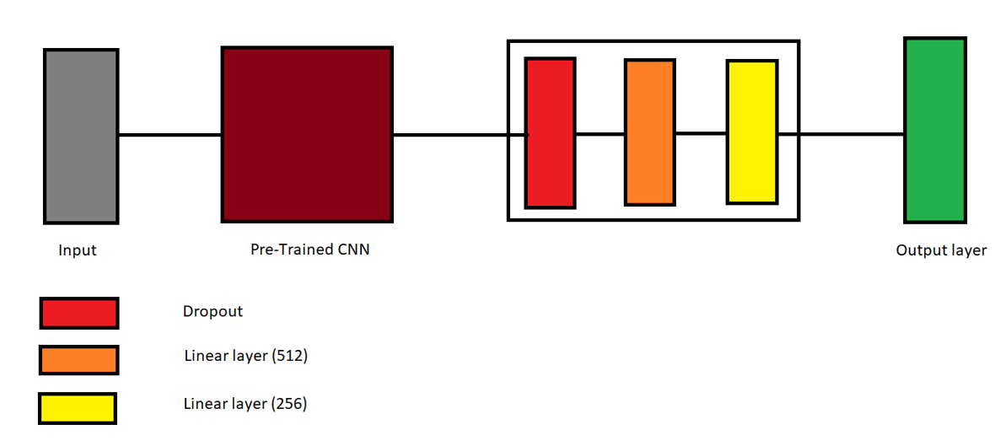

# CS725-Project

Objective of our project is to classify 25 distinct Indian bird species using machine learning techniques.

## About Project
The dataset that we have used is Indian-Birds-Species-Image-Classification.
It consist of 25 bird species found in India,
Each species has 1,500 images in the dataset.
The dataset contains a total of 37,500 images split into train and validation sets in an 80:20 ratio, with 30,000 images in the training set and 7,500 images in the test set.

As there are 25 Bird species in the dataset we have label encoded the images(0 to 24).

We have splitted the data into train, test and validation sets with the sizes 64%, 16% and 20% where each set has equal number of samples for each label.
Passed the training data through an augmentation layer which randomly flips and resizes the images.

Training a full neural network from scratch is time consuming. So, we used some pretrained CNNs and applied two layers on it. We used a variety a pretrained CNNs and showed their results.

Models:
ResNet 50, EfficientNet V2 B0, MobileNet V2, Vision Transformer

And lastly ensemble all the above models with averaging (linear mean and geometric mean).

### Our Model Architecture:



### Performance Metrics

For performance measurement we used Precision, Recall, F1 scores and [Matthews correlation coefficient](https://scikit-learn.org/1.5/modules/model_evaluation.html#matthews-corrcoef)

| Model                   | Accuracy Score | Top-3 Accuracy | Precision Score | Recall Score | F1 Score | Matthews Corrcoef |
|-------------------------|----------------|----------------|-----------------|--------------|----------|-------------------|
| ResNet-50              | 0.879467       | 0.965467       | 0.885268        | 0.879467     | 0.880337 | 0.874638          |
| EfficientNet V2        | 0.952400       | 0.988533       | 0.953052        | 0.952400     | 0.952445 | 0.950440          |
| MobileNet V2           | 0.910533       | 0.977067       | 0.916134        | 0.910533     | 0.910790 | 0.907025          |
| ViT-B32                | 0.921333       | 0.981867       | 0.922966        | 0.921333     | 0.921455 | 0.918111          |
| Linear Mean Ensemble   | 0.970933       | 0.993467       | 0.971437        | 0.970933     | 0.971026 | 0.969736          |
| Geometric Mean Ensemble| 0.973467       | 0.994000       | 0.974063        | 0.973467     | 0.973594 | 0.972376          |


## Running

Set up environment in kaggle / colab:
```sh
pip install requirements.txt
```
Import the [dataset](https://www.kaggle.com/datasets/ichhadhari/indian-birds) in kaggle / colab and import our notebook.

## References

- Dataset [Indian-Birds-Species-Image-Classification](https://www.kaggle.com/datasets/ichhadhari/indian-birds)
- [Tensorflow](https://www.tensorflow.org/) for training and models
    - [ResNet50](https://www.kaggle.com/models/tensorflow/resnet-50)
    - [EfficientNetV2](https://www.kaggle.com/models/google/efficientnet-v2)
    - [MobileNetV2](https://www.kaggle.com/models/google/mobilenet-v2)
    - [ViT](https://github.com/faustomorales/vit-keras)
- [Sklean](https://scikit-learn.org/1.5/modules/model_evaluation.html) for metrics